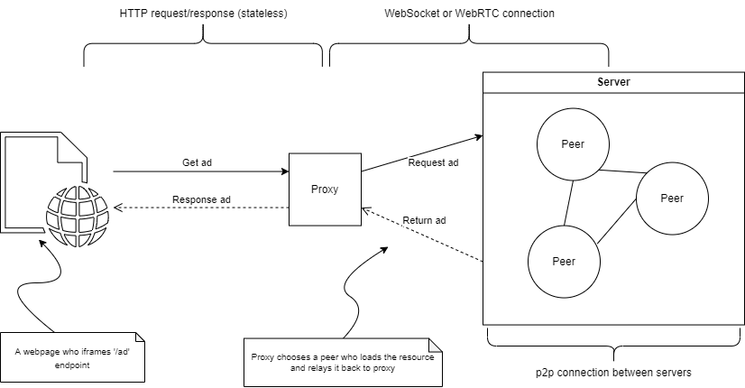

<h1 align="center">
    <a name="readme-top"></a>
    
    <b> AdShare</b>
</h1>

<h3 align="center"> CPSC 559 - Introduction to Distributed Systems </h3>
<h4 align="center"> <i>Final Project</i> - <a href="https://www.ucalgary.ca/">University of Calgary</a> (Winter 2023) </h4>


<h3> Built using </h3>

[](https://nodejs.org/en/)
[](https://reactjs.org/)
[](https://expressjs.com/)
[](https://socket.io/)
[](https://cloud.google.com/)
[](https://docker.com)

---
<details>
  <summary>Table of Contents</summary>
  <ol>
    <li>
      <a href="#about-project">Inspiration</a>
    </li>
    <li>
      <a href="#getting-started">Getting Started</a>
      <ul>
        <li><a href="#prerequisites">Prerequisites</a></li>
        <li><a href="#docker-way">Docker</a></li>
        <li><a href="#boring-way">Node & npm</a></li>
      </ul>
    </li>
    <li><a href="some-info">How does it work</a>
    <li><a href="features">Distributed System Features</a>
    <li><a href="#too-much-time">Configuration</a></li>
    <!--FUTURE!
    <li><a href="#contributing">Contributing</a></li>
    <li><a href="#license">License</a></li>
    <li><a href="#contact">Contact</a></li>
    -->
    <li><a href="extra">Feedback</a></li>
    <li><a href="#acknowledgments">Contributors</a></li>
  </ol>
</details>

---

<h2 id="inspiration"> Inspiration :milky_way: </h2>

Web advertising is everywhere these days, from banner ads to pop-ups and even videos. But did you know that the industry is dominated by a few big players, like Google, Amazon and Ezoic, who control all the ad hosting from their massive data centers? For small businesses, it's an uphill battle to compete with these giants and turn a meaningful profit. Introducing AdShare!

Our platform is a solution for the challenges posed by the current centralized approach to web advertising. With the rise of Web3.0 and the push towards decentralization, we believe that our decentralized advertising platform aligns with the future of the web. Anyone can use some spare computing power to host ads and earn money, making it easier and more affordable for smaller players to get their message out there. Plus, by cutting out the middleman, we're reducing the overhead costs for everyone involved. It's a win-win for advertisers and users alike!
<p align="right">(<a href="#readme-top">back to top :arrow_up: </a>)</p>

<h2 id=> Getting Started :tada: </h2>

* Prerequisites:
    - For the simplest way, ensure [Docker](https://docs.docker.com/get-docker/) and [Docker Compose](https://docs.docker.com/compose/install/) are installed locally.
    - For the long way, ensure [Node](https://nodejs.org/en/download) and [npm](https://nodejs.org/en/download) are installed locally. 


* <h3 id="docker-way"> Docker :whale: </h3>

    1. Using pre-built images :camera: (recommended)
        - Container images for both the Proxy and Peer are avaialble on GHCR which can be pulled and used directly.    
        - <b>Peer</b>:
            - In a terminal, run `docker run -p 50000:50000/tcp bgunson/as-peer`       
            - Terminate at any time by pressing Ctrl+C. 

        - <b>Proxy</b>:
            - In a terminal, run `docker run -p 3000:3000/tcp bgunson/as-proxy` 
                - NB: This will start the container in <i>foreground</i> mode and your terminal will be attached to the container's process. 
                - To avoid this, add a `-d` option after `run` so that the container will run in the <i>background</i>.

    2. Using Docker Compose :books:
        - To run the <b>Peer</b>as a Docker container:
            - Clone the project [repository](https://github.com/bgunson/as.git) and `cd` to the directory via terminal/console.
            - Run `docker-compose up` in the root directory.
            - Terminate at any time by pressing Ctrl+C. 

* <h3 id="boring-way"> Node and npm </h3>
    
    If you want to get things set up and running locally this way, you need to clone the project [repository](https://github.com/bgunson/as.git).

    - To run a <b>Peer</b>:
        - Open a terminal, `cd` into where you cloned the repo.
        - `cd` into `as/peer` folder.
        - Run `npm install` to install the project dependencies.
        - Run `npm start` to start the Peer server.
            - You can run any number of these in multiple terminals.
    
    - To setup the <b>GUI</b> for the Peer:
        - Open another terminal, `cd` into where you cloned the repo.
        - `cd` into `as/peer/frontend` folder.
        - Run `npm run build`
        
    - To run a <b>Proxy</b>:
        - Open another terminal, again `cd` into where you cloned the repo.
        - `cd` into `as/proxy` folder.
        - Run `npm install` followed by `npm start`

    Once a Peer is running and connected to a Proxy's swarm, you can access the GUI by visiting [http://localhost:3000](http://localhost:3000). 
    
    Then finally, open the client by going cloning the [repo](https://github.com/bgunson/as) locally and opening `docs/index.html` in your preferred web browser. 

    You can also visit [https://bengunson.me/as-example-client](https://bengunson.me/as-example-client)

    You should then see an iframed ad which was given by the to the client from the peer server(s) via the proxy.
    
    To learn more about changing the port to something else and for configuring stuff, read <a href="too-much-time"> this </a> section.

<h2 id="some-info"> How does it work :question: </h2>

AdShare works by allowing users to download a client, called the <b>Peer</b>, that turns their computer into a peer server. Once this peer joins a <b>Swarm</b> network of other Peers, they can host and exchange ads with each other. We use Docker for improved scalability and portability, so our application can work seamlessly in different environments.

Users can upload their own ads and choose how much they want to pay to ensure their ad gets replicated and seen by more people. The more replication, the more money they can earn. Users running the peer server are paid according to how many ads they serve to clients, creating a supply and demand system in the marketplace.

A <b>Proxy</b> server is used to "broker" connections between clients and peer servers. If no peers are available, the proxy server will serve an advertisement for our service.

You can read our Proof of Concept [here](./docs/README.md#adshare-proof-of-concept) to get a better idea of what's going on under the hood!
<p align="right">(<a href="#readme-top">back to top :arrow_up: </a>)</p>

<h2 id="features"> Implemented Features for the Distributed System :high_brightness: </h2>

<details>
    <summary> 
        <b>Replication</b> 
    </summary>
    Lorem Ipsum
</details>

<details>
    <summary> 
        <b>Scalability</b> 
    </summary>
    Lorem Ipsum
</details>

<details>
    <summary> 
        <b>Fault Tolerance</b> 
    </summary>
    Lorem Ipsum
</details>

<details>
    <summary> 
        <b>Consistency</b> 
    </summary>
    Lorem Ipsum
</details>

<details>
    <summary> 
        <b>Synchronization</b> 
    </summary>
    Lorem Ipsum
</details>

<details>
    <summary> 
        <b>GUI</b> 
    </summary>
    Lorem Ipsum
</details>
<p align="right">(<a href="#readme-top">back to top :arrow_up: </a>)</p>

<h2 name="too-much-time"> Configuration</h2>

A `.env` or `.env-cmdrc` file will contain the necessary configuration for the application to run. 

Following security best practices, it is recommended you create either of those files and place them in the `peer` folder (and the `proxy` folder as well if you want to run the <b> Proxy</b> locally!).

The general format of a `.env` file is:
```
VARIABLE=YOUR_VALUE 
```
You can read more about the environment variables [here](./docs/README.md#environment-variables).
<p align="right">(<a href="#readme-top">back to top :arrow_up: </a>)</p>

<h2 id="future"> What's next for AdShare :dart: </h2>

We would love some constructive feedback. This was a great learning experience for us all and we would love to see how we could improve the project. <br><br>
<p align="right">(<a href="#readme-top">back to top :arrow_up: </a>)</p>

<h2 id="contributors">Contributors :scroll: </h2>

* Bennett Gunson
* Kirill Larshin
* Steven Susanto
* Taylor Jones
* Ranadip Chatterjee 
<p align="right">(<a href="#readme-top">back to top :arrow_up: </a>)</p>
