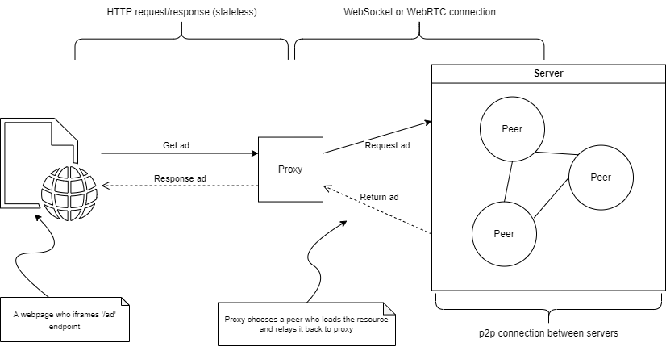

# Adshare Proof of Concept
#### CPSC 559 - Group 7
___

Here is a small NodeJS proof of concept for AdShare using the client-server architecture. We have 3 actors that interact with the system: the Proxy, the Peer, and the Client.

- Proxy: is an always active, dynamically (DNS) named web server which handles distribution of advertisments.
- Peer: is any machine opted into adshare who stores and returns ad files to the proxy, then further to the clients.
- Clients: are any website which embeds an adshare endpoint in their site.

To run, make sure you have Node and npm installed on your computer and run:

Next in the following order in separate terminals (processes):

Running proxy server locally:
```
cd proxy
npm install
npm start
```
- NB: A working proxy is also live at [adshare.cloud](http://adshare.cloud).

Running peer servers locally:
- You can run any number of these in multiple terminals to simulate a distrubuted system.
```
cd server
npm install
npm start
```
- To run the peer server as a Docker container:
    - Ensure Docker is installed locally.
    - Run `docker-compose -f docker-compose-prod.yml up` in the root directory
    - Terminate the peers at any time by pressing Ctrl+C 

Then finally, open the client by going cloning the [repo](https://github.com/bgunson/as) locally and opening `docs/index.html` in your preferred web browser. 
- You can also visit [https://bengunson.me/as-example-client](https://bengunson.me/as-example-client)

You should then see an iframed ad which was given by the to the client from the peer server(s) via the proxy.

___

## The Actors

### Proxy
The proxy handles http requests as well as a websocket endpoint. THe websocket server is what servers will connect to indicating they are online and willing to provide resources. With the websocket we get a persistent socket (connect/disconnect events) so we can add/remove hosts who come and go during the proxy's lifetime. We can also load any number of http/rest endpoints within the proxy to provide any more functionality.

In this example the proxy is listening on port 3000. In production we would host the proxy remotely with a known domain so it is always accessible. We will also be able to host whatever web client we want publicly facing here as well.

### Server
This is a peer or host who stores and serves ad images to the proxy. It uses a websocket client (socket.io-client) to connect to the proxy when it is run and waits for the event 'get-ad' that when asked can stream a random (or not) ad image back to the proxy who sends it to a client.

### Client
This would be any website using our service. For now it is just a single html page with an iframe pointing to the proxy at the '/ad' endpoint which returns an image in full.

___


## Environment variables
<a name="readme-envars-detail"></a>

* <b>Peer</b>

| Variable                    | Description                                                                                                                                                  | Default Value                           |
|-----------------------------|--------------------------------------------------------------------------------------------------------------------------------------------------------------|------------------------------------|
| `NODE_ENV`    | Define the current environment of the Node.js app                                              | production                                |
| `PEER_PORT`            | Define the port at which the Peer server (API) will be available at.                                                                               | 3000                                |
| `SERVER_URL`            | Define the URL of primary Proxy server to which the Peer will try to connect to.                                                                               | https://amazing-limiter-378022.uw.r.appspot.com                                |
| `SERVER_URL_BACKUP_1`            | Define the URL to backup Proxy server to which Peer will try to connect to in case the primary is unresponsive.                                                                               | http://aspxy3.bhodrolok.xyz/                                |
| `SERVER_URL_BACKUP_2`            | Define the URL to backup Proxy server to which Peer will try to connect to in case the primary and other backup is unresponsive.                                                                               | http://aspxy4.bhodrolok.xyz/                                |
| `CONN_TIMEOUT`            | Define the timeout, in milliseconds, for each connection attempt.                                                                               | 6000                                |
| `NUM_RETRIES`            | Define the number of times the Peer will attempt reconnecting to the Proxy.                                                                               | 2                               |
| `RETRY_INTERVAL_MS`            | Define the intiial delay (in milliseconds) between each reconnection attempt.                                                                              | 1234                               |


___
## Communication Sequence Diagram


___
## System Architecture

